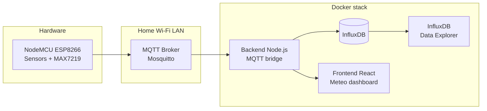

# ESP8266 Meteo Station (NodeMCU + Lua)

Small meteo / air-quality station based on **NodeMCU (ESP8266)** and **Lua (NodeMCU firmware)**.

The station:

- reads temperature, humidity, pressure and gas sensors
- publishes live telemetry via **MQTT**
- stores data in **InfluxDB**
- visualises metrics in a **web dashboard** (Vite/React) and InfluxDB **Data Explorer**
- prints debug info to the serial console
- shows values on a **MAX7219** LED display

## Architecture



- NodeMCU publishes JSON telemetry over MQTT.
- Mosquitto receives all meteo/+/reading messages.
- Backend subscribes to MQTT, stores points in InfluxDB and pushes live data to the browser via WebSocket /ws.
- Frontend renders charts (AHT, BMP, MQ sensors) with baselines and current values.
- InfluxDB UI is used for ad-hoc analysis with Flux.

## Features

- **Temperature & Humidity**
  - **AHT10** (I²C): temperature + relative humidity
  - **BMP280 / BME280** (I²C): temperature + pressure (humidity only if BME280 is used)
  - Average temperature is calculated from *BMP* and *AHT*: `bmp`, `aht`, `avg`
  
- **Pressure**
  - Raw and sea-level pressure (QNH) from BMP/BME sensor
  
- **Gas sensors**
  - **MQ135** – air quality / VOC
  - **MQ3** – alcohol sensor
  - Both sensors are read through an analog input (via multiplexer)
  
- **Display**
  - **MAX7219** 7-segment or LED module
  - Cycles through values (temperature, pressure, gas readings, etc.)
  
- **Debug output**
  - Human-readable logs on serial port: `[MEASURE]`, `[BMP]`, `[AHT]`, `[TEMP]`, `[MQ]`, `[DSP]`, `[MAX]`, `[HB]` (heartbeat)
  - Handles sensor errors and falls back to cached values when needed
  
- **Networking**
  - Connects to home Wi-Fi as a station
  - Publishes telemetry to MQTT broker:
    - Topic: `meteo/<deviceId>/reading`
    - Payload: compact JSON with all sensor values

### Web interface


### Backend / Influx / Frontend

- **Backend (Node.js + TypeScript)**
  - Connects to `mqtt://mosquitto:1883`
  - Subscribes to `meteo/+/reading`
  - Parses JSON payload, validates numeric fields
  - Writes points to InfluxDB bucket `meteo`
  - Broadcasts last reading via WebSocket `/ws` to all connected clients

- **InfluxDB**
  - Stores time-series for: `aht_t`, `aht_h`, `bmp_t`, `bmp_p`, `mq135`, `mq3`
  - Data Explorer is used to query bucket `meteo` and build Flux graphs

- **Frontend (Vite + React + TS)**
  - Connects to backend via WebSocket (`VITE_WS_URL`, default `ws://localhost:4000/ws`)
  - Renders charts:
    - AHT10: temperature & humidity on one chart
    - BMP280 temperature
    - BMP280 pressure (in mmHg with reference line at 760 mmHg)
    - MQ135 raw ADC
    - MQ3 raw ADC
  - Each chart shows:
    - Current value for every series
    - Y axis labels and X axis time grid
    - Mean baseline for the main series
    - Charts resize with the browser width

## Hardware

Required components:

- NodeMCU v2 / v3 (ESP8266)
- **BMP280 / BME280** (I²C)
- **AHT10** (I²C)
- **MQ135** gas sensor
- **MQ3** gas/alcohol sensor
- Analog multiplexer (CD4052 or similar, for sharing ADC between MQ sensors)
- **MAX7219** LED display (7-segment or matrix)
- Breadboard / wires, 5V power supply for sensors as required

## PIN OUTS / GPIO Configuration

All pin mappings are defined in `meteo.lua` and use NodeMCU D-pin notation (D0–D8 = GPIO 16, 5, 4, 0, 2, 14, 12, 13, 15):

| **Function** | **NodeMCU Pin** | **GPIO** | **Notes** |
|---|---|---|---|
| **I²C SDA** | D2 | GPIO4 | BMP280 + AHT10 (shared bus) |
| **I²C SCL** | D1 | GPIO5 | BMP280 + AHT10 (shared bus) |
| **MAX7219 DIN** | D7 | GPIO13 | SPI Data In |
| **MAX7219 CS** | D6 | GPIO12 | Chip Select |
| **MAX7219 CLK** | D5 | GPIO14 | SPI Clock |
| **MUX S0** | D0 | GPIO16 | Multiplexer channel bit 0 |
| **MUX S1** | D8 | GPIO15 | Multiplexer channel bit 1 |
| **ADC (MQ135/MQ3)** | A0 | ADC0 | Analog input from MUX output |

### Multiplexer Channels

The CD4052 (or similar) multiplexer routes MQ sensors to the single ADC input:

| **Channel** | **S1** | **S0** | **Sensor** |
|---|---|---|---|
| 0 | 0 | 0 | MQ135 (air quality) |
| 1 | 0 | 1 | MQ3 (alcohol) |

The multiplexer output is connected to NodeMCU **A0** (ADC0).

### I²C Bus Wiring

Both BMP280/BME280 and AHT10 share the same I²C bus:

```
NodeMCU D2 (SDA) ──── BMP280/BME280 SDA
                 \─── AHT10 SDA
                 
NodeMCU D1 (SCL) ──── BMP280/BME280 SCL
                 \─── AHT10 SCL

GND ──────────────── BMP280/BME280 GND
                 \─── AHT10 GND
                 
3.3V ─────────────── BMP280/BME280 VCC
                 \─── AHT10 VCC
```

## MQTT Telemetry Format

NodeMCU publishes telemetry every few seconds:

- **Topic:** `meteo/<deviceId>/reading`
- **Example payload:**

```json
{
  "deviceId": 8489819,
  "bmp_t": 25.1,
  "bmp_p": 1001.4,
  "bmp_qnh": 1025.4,
  "aht_t": 26.5,
  "aht_h": 28.6,
  "mq135": 243,
  "mq3": 192
}
```

Backend parses this JSON and writes numeric fields as float values to InfluxDB.

## Configuration

Tunable parameters are defined at the top of `meteo.lua`:

| **Parameter** | **Value** | **Description** |
|---|---|---|
| `ALT_M` | 200 | Altitude in meters (used to calculate QNH sea-level pressure) |
| Measurement interval | 5000 ms | Set via `tmr.create():alarm(5000, ...)` in `M.start()` |
| Heartbeat interval | 30000 ms | Set via `tmr.create():alarm(30000, ...)` in `M.start()` |
| Display cycle | 4 states | Rotates: MQ135 → MQ3 → Tavg×10 → Pressure |
| `MQTT_HOST` | LAN IP | Your host machine IP (e.g., 192.168.1.12) for Docker bridge |
| `MQTT_PORT` | 1883 | MQTT broker port |
| `MQTT_BASE` | "meteo" | Topic base path |

### MQ Sensor Calibration

The MQ sensors use a **baseline calibration** approach:

- On first read, the raw ADC value is stored as the baseline (`mq135_base`, `mq3_base`)
- Subsequent readings are compared as a ratio to the baseline
- Classification is done using thresholds (e.g., ratio < 0.85 = "cleaner", ratio < 1.20 = "normal", etc.)

Adjust the classification thresholds in `classify_mq135()` and `classify_mq3()` functions as needed.

## Firmware

This project is built on **NodeMCU** firmware with a minimal set of modules to save RAM.

**Required modules:**
- `adc` – analog-to-digital conversion for MQ sensors
- `bit` – bit operations for MUX channel selection
- `bme280` – BMP280/BME280 pressure and temperature sensor
- `file` – file operations (optional, for future use)
- `gpio` – GPIO control
- `i2c` – I²C bus communication
- `mqtt` – MQTT client for telemetry publish
- `node` – node control and heap info
- `spi` – SPI interface (used by MAX7219)
- `tmr` – timers
- `wifi` – WiFi connectivity (for connecting to home LAN)

Build a custom NodeMCU firmware for **ESP8266** with at least these modules enabled.

## Getting Started

### 1. Run Docker stack (backend + Influx + frontend + Mosquitto)

From project root:

```bash
docker compose up --build
```

This starts:

- **mosquitto** – MQTT broker on `mqtt://mosquitto:1883`
- **influxdb** – InfluxDB with UI at `http://localhost:8086`
- **backend** – Node.js service on `http://localhost:4000`
- **frontend** – dashboard on `http://localhost:5173`

**Important:** Set `MQTT_HOST` in `meteo.lua` to your host machine IP (e.g., `192.168.1.12`) so NodeMCU can reach Mosquitto inside Docker.

### 2. Build and flash NodeMCU firmware

1. Build a NodeMCU firmware for **ESP8266** with required modules.
2. Flash it to the board using `esptool.py` or any other flashing tool.

Example (adjust port/paths):

```bash
esptool.py --port /dev/ttyUSB0 --baud 921600 write_flash -fm dout 0x00000 nodemcu.bin
```

### 3. Upload Lua scripts

```bash
nodemcu-tool upload init.lua meteo.lua aht10.lua max7219.lua --port=/dev/cu.usbserial-21410
```

Expected output:

```
[NodeMCU-Tool]~ Connected 
[device]      ~ Arch: esp8266 | Version: 3.0.0 | ChipID: 0x818b5b | FlashID: 0x164020 
[NodeMCU-Tool]~ Uploading "init.lua" >> "init.lua"... 
[NodeMCU-Tool]~ Uploading "meteo.lua" >> "meteo.lua"... 
[NodeMCU-Tool]~ Uploading "aht10.lua" >> "aht10.lua"... 
[NodeMCU-Tool]~ Uploading "max7219.lua" >> "max7219.lua"... 
[NodeMCU-Tool]~ Bulk File Transfer complete! 
```

Then reset:

```bash
nodemcu-tool reset --port=/dev/cu.usbserial-21410
```

### 4. Check serial logs

Open a serial terminal at **115200 baud** and reset the board. You should see logs similar to:

```
[init] booting...
[init] I2C setup on SDA=2 SCL=1
[init] AHT10: OK, BMP: OK (0x76=YES 0x77=NO)
[init] will start meteo.lua in 5s (time window for uploads)
[init] running meteo.lua
[meteo] timers started
[MQTT] connect ok 192.168.1.12:1883
[BMP] T=25.41C P=1000.8 hPa QNH=1024.9
[AHT] T=24.82C H=29.6%
[BMP] T=25.41C P=1000.8 hPa QNH=1024.9
[AHT] T=24.82C H=29.4%
[BMP] T=25.42C P=1000.8 hPa QNH=1024.9
```

The MAX7219 display will show the current value selected by the display cycle logic (temperature, pressure, gas level, etc.).

### 5. Open dashboard

- **Frontend:** http://localhost:5173
- **InfluxDB UI:** http://localhost:8086 (login, select bucket `meteo`, open Data Explorer)

You should see live curves for AHT, BMP, MQ135 and MQ3.

## How It Works

### Measurement Loop

On each measurement cycle (every 5 seconds):

1. **AHT10 is read:**
    - If there is a new frame, it logs `[AHT] T=... H=...%`
    - If there is no new data, it logs `[AHT] no new data, using cached` and reuses the last valid values

2. **BMP280/BME280 is read:**
    - If values are valid and within reasonable range (temp: -40–85°C, pressure: 800–1100 hPa), the reading is used
    - If out of range or nil, the script logs it and falls back to cached values
    - Logs: `[BMP] T=25.94C P=1002.7 hPa QNH=1026.8`

3. **Average temperature is computed:**
    - If both BMP and AHT are valid: `avg = (bmp_t + aht_t) / 2`
    - If only one is valid: `avg = that_sensor`

4. **MQ135/MQ3 are read via the multiplexer:**
    - Multiplexer channel is switched (S0/S1 pins control which sensor is active)
    - Raw ADC values are read from A0
    - Readings are mapped to a ratio scale and classified
    - Logs: `[MUX] ch=0 S0=0 S1=0` and `[MQ] 135=249 3=161`

5. **The selected metric is sent to MAX7219:**
    - Display cycles through 4 modes:
      - Mode 0: MQ135 raw value
      - Mode 1: MQ3 raw value
      - Mode 2: Tavg × 10 (average temperature)
      - Mode 3: Pressure in hPa
    - Logs: `[DSP] MQ135 249` and `[MAX] shown: 249`

6. **Telemetry is published to MQTT:**
    - JSON payload with all sensor readings is sent to `meteo/<deviceId>/reading`
    - Backend receives it, validates, and writes to InfluxDB

7. **Heartbeat messages** `[HB] heap=...` show memory status every 30 seconds.

The `[AHT] no new data, using cached` messages are **expected and normal** — they simply indicate that the sensor did not provide a new measurement on this particular cycle. The last valid sample is safely reused.

## Troubleshooting

### I²C Scan

Before running an I²C scan on the board, upload the scanner script to the device:

```bash
nodemcu-tool upload i2c_scan.lua --port=/dev/cu.usbserial-21410
```

Then run the scan:

```bash
nodemcu-tool run i2c_scan.lua --port=/dev/cu.usbserial-21410
```

Expected output (example):

```
[scan] setup I2C on SDA=2 SCL=1
[scan] found device at 0x38
[scan] found device at 0x76
[scan] done
```

If no devices are found, check:

- **Wiring:** SDA = D2, SCL = D1, common GND, 3.3V power to sensors
- **Pull-ups:** on the I²C lines (some breakout boards include them)
- **Sensor addresses:** AHT10 = 0x38, BMP280/BME280 = 0x76/0x77
- **Firmware:** NodeMCU firmware includes the `i2c` module

`init.lua` also performs an automatic I²C health check on boot (probes 0x38, 0x76 and 0x77 and prints a summary).

### MQTT / Backend / InfluxDB

- Check that NodeMCU can reach your host IP (ping from the device).
- Verify `MQTT_HOST` and `MQTT_PORT` in `meteo.lua` match your Docker setup.
- In Docker logs, you should see:

```
mosquitto    | 1701234567: New connection from 192.168.1.50 on port 1883.
mosquitto    | 1701234567: New client connected from 192.168.1.50 as esp_8489819, c1, clean session.
backend      | [MQTT] connected to mqtt://mosquitto:1883
backend      | [MQTT] subscribed to meteo/+/reading
backend      | [WRITE] wrote point to meteo: bmp_t=25.1 bmp_p=1001.4 aht_t=26.5 aht_h=28.6
```

### WiFi Connection

If NodeMCU cannot connect to WiFi:

- Check WiFi credentials in `meteo.lua` (verify `WIFI_SSID` and `WIFI_PASSWORD`)
- Check `MQTT_HOST` (MQ broker host)
- Check router logs to see if the device is trying to connect
- Ensure the board is close enough to the router
- Try rebooting the device

## Roadmap / Ideas

- Persist MQ baselines and configuration to flash (file API)
- Expose more metrics in frontend (QNH, moving averages, min/max)
- Add Web UI for calibration and configuration
- OTA script updates for NodeMCU
- Support for additional sensors (CO₂, PM2.5, etc.)

---

License: BSD